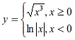

# Задания к зачёту по дисциплине "Разработка программного обеспечения"

Вариант 28




## Задание 1

В командной строке передать список чисел для вычисления, например:

```bash
python main.py 1 -2 3 9.15
```


## Задание 2

Тестирование:

```bash
python -m unittest -v test_main.py
```


## Задание 3

Графический интерфейс:
	
```bash
python main_gui.py
```

